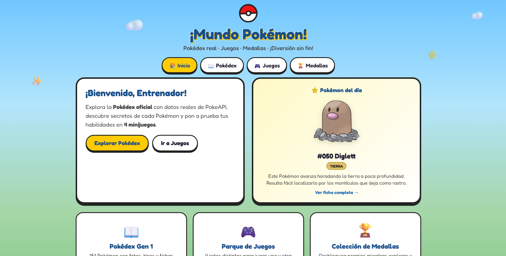
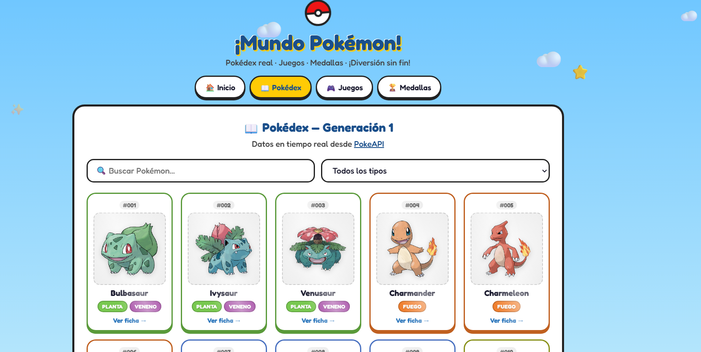
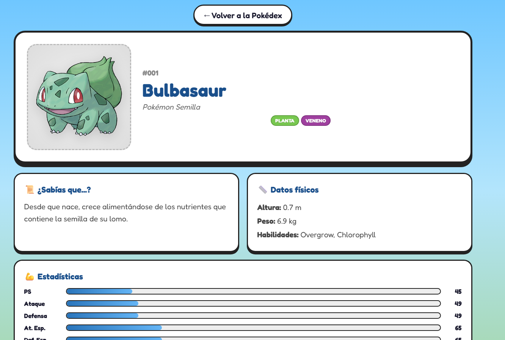
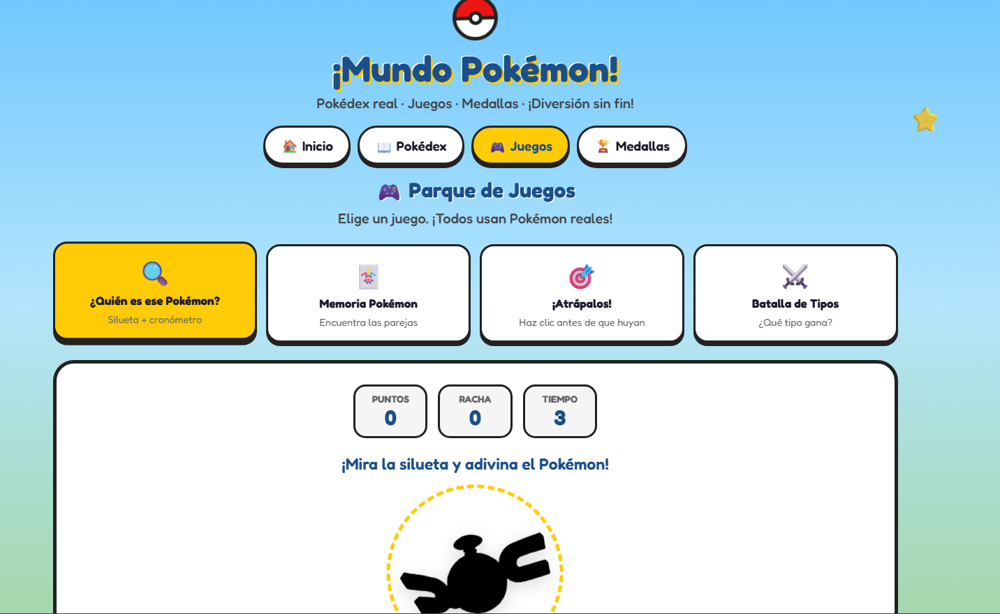
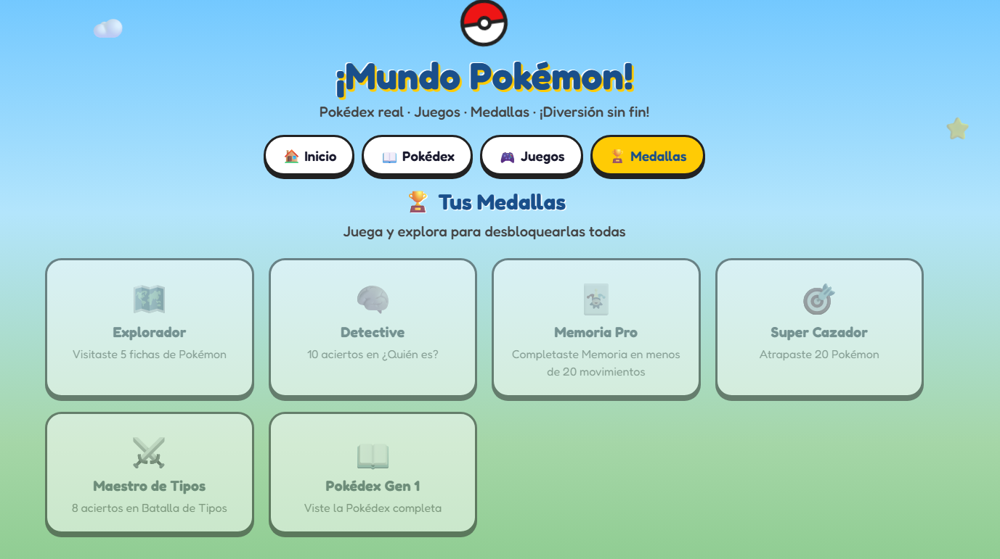

# 🎮 Mundo Pokémon

Una aplicación web interactiva desarrollada con **HTML5, CSS3 y JavaScript** que permite explorar la Pokédex de la primera generación, consultar información detallada de cada Pokémon mediante la **PokeAPI** y disfrutar de varios minijuegos temáticos.

---
## 📸 Vista previa

### 🏠 Página principal



### 📖 Pokédex



### 🔍 Detalle del Pokémon



### 🎮 Minijuegos



### 🏅 Sistema de medallas



---

## ✨ Características

- 📚 Pokédex con los 151 Pokémon de la primera generación.
- 🔍 Búsqueda por nombre o número.
- 🏷️ Filtros por tipo.
- 📄 Página de detalle de cada Pokémon.
- 📊 Estadísticas visuales.
- 🔄 Cadena evolutiva.
- ⭐ Pokémon del día.
- 🎮 Cuatro minijuegos interactivos.
- 🏅 Sistema de medallas y logros.
- ⚡ Consumo de datos mediante PokeAPI.
- 💾 Optimización mediante almacenamiento en caché.
- 📱 Diseño responsive compatible con dispositivos móviles.
  
---

## 🛠️ Tecnologías utilizadas

- HTML5
- CSS3
- JavaScript (ES6+)
- Fetch API
- PokeAPI

---

## 📂 Estructura del proyecto

```text
POKEMON/
│
├── assets/
│   └── screenshots/
│       ├── home.png
│       ├── pokedex.png
│       ├── detail.png
│       ├── games.png
│       └── medals.png
│
├── css/
├── js/
├── index.html
├── pokemon.html
└── README.md
```

---

## 🚀 Instalación

1. Clona este repositorio:

```bash
git clone https://github.com/TU-USUARIO/TU-REPOSITORIO.git
```

2. Accede a la carpeta del proyecto.

3. Abre el proyecto con Visual Studio Code.

4. Ejecuta un servidor local (por ejemplo, utilizando la extensión **Live Server**).

---

## 🌐 API utilizada

Este proyecto obtiene toda la información de los Pokémon desde:

**https://pokeapi.co/**

---

## 💻 Funcionalidades

### 📖 Pokédex

Permite explorar los Pokémon de la primera generación mostrando:

- Imagen oficial
- Número
- Nombre
- Tipos
- Descripción
- Estadísticas
- Habilidades
- Evoluciones

### 🔍 Buscador

El usuario puede localizar Pokémon mediante:

- Nombre
- Número
- Tipo

### ⭐ Pokémon del día

Cada día se muestra automáticamente un Pokémon diferente en la pantalla principal.

### 🎮 Minijuegos

La aplicación incorpora diferentes juegos para aprender sobre el universo Pokémon de forma interactiva.

### 🏅 Sistema de medallas

El usuario puede desbloquear logros y medallas conforme avanza en la aplicación.

---

## 📚 Conceptos aplicados

Durante el desarrollo de este proyecto se han utilizado conceptos como:

- Manipulación del DOM
- Programación modular
- Programación asíncrona (`async/await`)
- Consumo de APIs REST
- Uso de `fetch`
- Gestión de eventos
- Renderizado dinámico de contenido
- Organización modular del código
- Responsive Design

---

## 📱 Responsive Design

La aplicación está adaptada para visualizarse correctamente en:

- 💻 Ordenadores
- 📱 Smartphones
- 📟 Tablets

---

## 👩‍💻 Autora

**Etel Cedréz**

Proyecto desarrollado como práctica de desarrollo web utilizando JavaScript, HTML, CSS y consumo de APIs REST.

---

## 📄 Licencia

Este proyecto tiene fines educativos.

Los datos e imágenes pertenecen a **Nintendo**, **Game Freak** y **The Pokémon Company**, y son obtenidos a través de **PokeAPI**.
